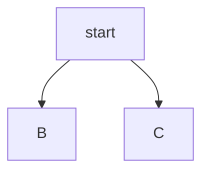
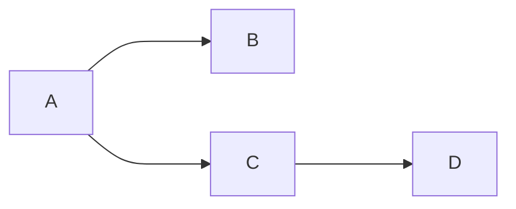
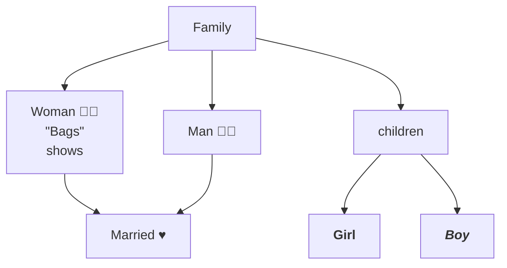
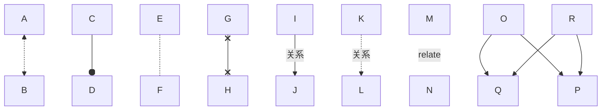
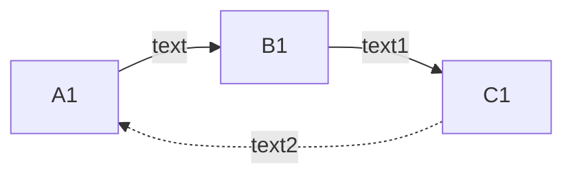
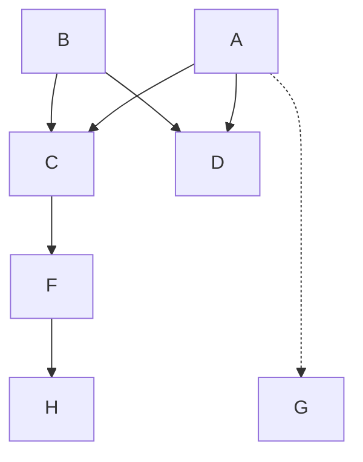
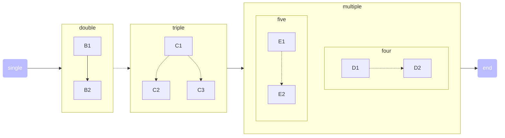
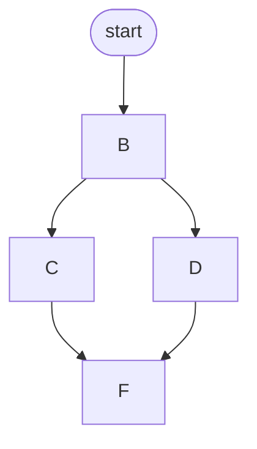
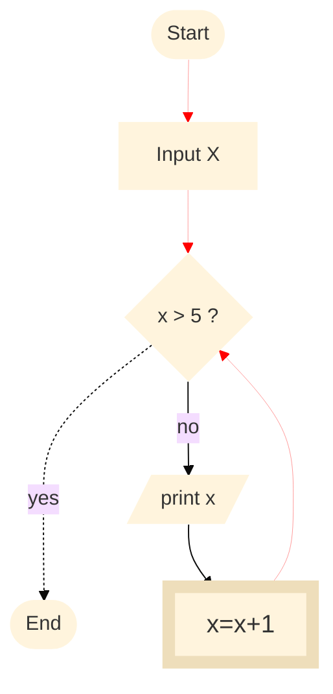
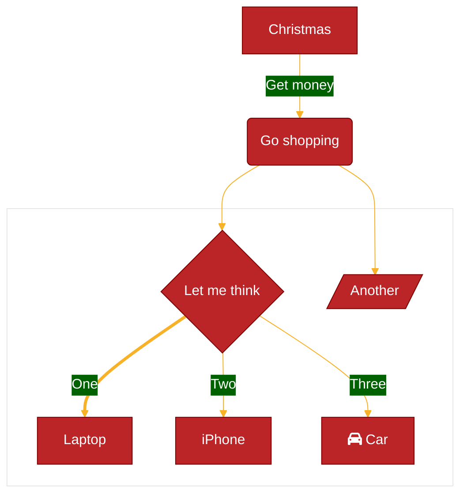

---
tags:
  - Chart
created_at: 2026-01-14
category:
  - flowchart
published:
---
# 流程图

- 流程图是一个过程或者系统的一种视觉呈现，它使用符号和连接线演示过程中涉及的步骤顺序，分支以及操作。流程图在许多领域中被广泛地应用，包括商业/工程/软件开发/项目管理等，它以一种清晰且简单的方式来表达复杂的过程或者流程。
- 流程图由多个节点和边缘组成（线条或箭头），`Mermaid` 代码定义了节点和边缘如何生成，包含了不同的箭头类型，多向箭头，如何与子流程图相连

| 符号         | 名称    | 用途                  |
| :--------- | :---- | :------------------ |
| 圆角矩形       | 开始/结束 | 通常表示一个流程的开始和结束      |
| 矩形         | 行为操作  | 表示在这个节点需要做的操作或者执行任务 |
| 菱形         | 分支    | 表示流程在当前节点会有多个条件分支   |
| 平行四边形（斜切形） | 输入/输出 | 表述数据或者信息的输入输出       |
| 箭头         | 链接方向  | 链接不同的节点，表示流程的方向     |

## 基础

## 方向

- **TB**: Top to bottom
- **TD**: Top to down / same as top to bottom
- **BT**: Bottom to top
- **RL**: Right to left
- **LR**: Left to Right

## 节点文字

## 连接线

## 子流程图

## 事件交互

在 `obsidian` 中，有**内部链接**和**外部链接**两种交互方式可用

## 自定义样式

## 线条动画

obsidian 内置的 mermaid 暂时不支持线条动画，可以从官网文档中查看[线条动画](https://mermaid.js.org/syntax/flowchart.html#turning-an-animation-on)
