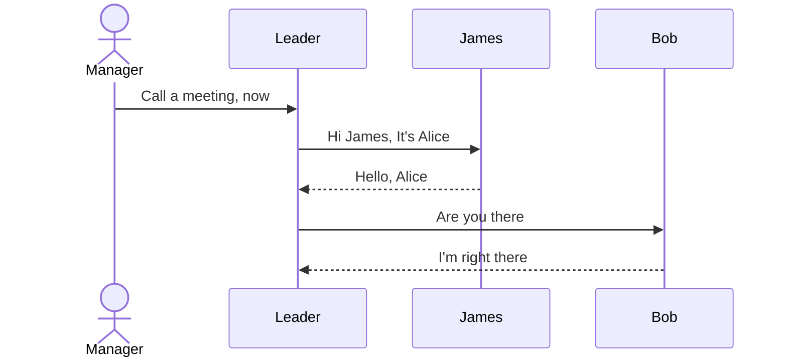

---
tags:
  - Diagram
  - Library
  - Chart
category:
  - IT
  - sequence
created_at: 2026-01-15
published:
---
# 时序图

1. 时序图是 UML[^1] 交互性图形中的一种，用于展示在一个系统中一段时间内，在不同对象或组件之间的消息和交互的流向。同时显示了同个系统内，不同的元素是如何协作完成特定功能和应用场景的。
2. 时序图由几部分组成：
	- *lifelines*: 竖线，表示一段时间内，对象或组建的存在
	- *actors and participants*: 在 lifeline 的上下端，并链接；actors 一般表示外部实体，participants 表示内部的参与组件。
	- *messages*: 消息是箭头指向，演示消息的流向和顺序
	- *action bars*: 竖向条表示对象活动或者过程处理的时间
	- *alternate frames*: 表示可选的部分或者场景，标识条件和选择

## 用途
1. **时序图可以帮助理解系统行为**: 用视觉化来呈现，在一个系统内，不同对象和组件之间是如何交互的，消息如何流转，他们按照怎样的顺序执行。
2. **利于沟通交流**：作为一种视觉交流工具，时序图通过以清晰简明方式，将复杂的交互呈现出来，减少了参与人员之间的讨论。通常在技术团队和非技术团队之间能够有效的传递想法和信息。
3. **设计和文档**: 在系统设计期间，时序图还可以为系统的动态部分充当文档角色，提供了简要的蓝图，开发人员设计时可以参考。
4. **发现问题和性能提升**: 开发者使用时序图去系统的分析潜在的问题或者瓶颈，有助于优化和提升系统性能。
5. **测试和验证**: 时序图是设计测试用例的基础，特别是针对多个组件间交互的场景。通过不同的测试用例，辅助验证系统是否如我们期望的那样运行
6. **系统维护**: 在系统维护或者更新期间，时序图帮助开发者理解组件间已存在的交互。分析新的系统改变可能造成的潜在影响。
7. **原型和计划**: 在项目早期，有效的时序图可以帮助理解不同模块间可能存在的数据流向，有助于初始的设计决定和架构。
8. **训练和演示**: 新成员用时序图可以更快更好的理解系统的工作流程。

## 基础用法

[^1]: UML 表示[统一建模语言](https://zh.wikipedia.org/wiki/%E7%BB%9F%E4%B8%80%E5%BB%BA%E6%A8%A1%E8%AF%AD%E8%A8%80)
	
